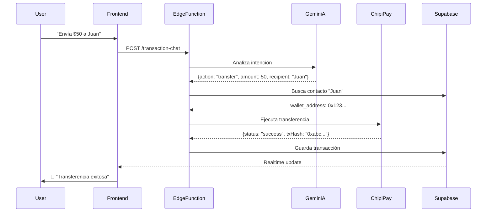

# 🚀 Blocky - Tu Asistente Financiero Web3 Inteligente

<div align="center">


**Democratizando el acceso a blockchain mediante la convergencia de IA y Web3**

[Demo en Vivo](https://lovable.dev/projects/6623e294-38e2-46b4-b537-b34f19251e9c) • • [Documentación](#tecnologías-utilizadas)

</div>

---

## 📋 Tabla de Contenidos

- [El Problema](#-el-problema)
- [Nuestra Solución](#-nuestra-solución)
- [Funcionalidades Principales](#-funcionalidades-principales)
- [Pantallas de la Aplicación](#-pantallas-de-la-aplicación)
- [Innovación: AI + Blockchain](#-innovación-ai--blockchain)
- [Arquitectura Técnica](#-arquitectura-técnica)
- [Tecnologías Utilizadas](#-tecnologías-utilizadas)
- [Reducción de Barreras Técnicas](#-reducción-de-barreras-técnicas)
- [Impacto Esperado](#-impacto-esperado)
- [Instalación y Uso](#-instalación-y-uso)
- [Equipo](#-equipo)

---

## 🎯 El Problema

**El 97% de la población mundial NO usa blockchain.** ¿Por qué?

- **Complejidad técnica abrumadora**: Términos como "gas fees", "private keys", "smart contracts" alejan a usuarios no técnicos
- **Interfaces hostiles**: Los wallets tradicionales requieren conocimientos de criptografía
- **Curva de aprendizaje empinada**: Se necesitan horas de estudio para realizar una simple transacción
- **Miedo a perder fondos**: Un error puede significar la pérdida irreversible de dinero
- **Desconexión entre Web2 y Web3**: La experiencia de usuario retrocede 15 años al usar blockchain

**Resultado**: La tecnología blockchain permanece inaccesible para el público general, limitando su potencial transformador.

---

## 💡 Nuestra Solución

**Blocky** es un asistente financiero Web3 que hace que interactuar con blockchain sea **tan simple como chatear con un amigo**. Eliminamos toda la complejidad técnica mediante:

### 🤖 IA Conversacional Contextual
En lugar de formularios complejos, **solo pregunta**:
- "Quiero enviar $50 a María"
- "¿Cuánto gané este mes en mis inversiones?"
- "Paga mi factura de luz"
- "Explícame qué son los NFTs como si tuviera 5 años"

### 🔐 Gestión Automatizada de Wallets
- **Creación invisible**: La wallet se crea automáticamente al registrarte (usando ChipiPay API)
- **Sin claves privadas expuestas**: Todo se maneja de forma segura en segundo plano
- **Recuperación simplificada**: No más seed phrases de 24 palabras

### 🎓 Educación Financiera Gamificada
- Aprende haciendo, con un tutor IA personalizado (Google Gemini 2.5 Flash)
- Misiones interactivas con recompensas
- Conceptos complejos explicados en lenguaje cotidiano

### ⚡ Transacciones sin Fricción
- **Lenguaje natural**: "Transfiere 100 USDC a Juan"
- **Confirmación inteligente**: La IA verifica antes de ejecutar
- **Notificaciones en tiempo real**: Siempre sabes qué está pasando

---

## ✨ Funcionalidades Principales

### 1. 💳 Gestión de Wallet Inteligente
- **Creación automática** al registrarte con ChipiPay API
- **Balance unificado** con conversión automática a moneda local
- **Historial de transacciones** con búsqueda por voz o texto
- **Multi-token support**: Maneja USDC, ETH, BTC, tokens nativos y más

### 2. 💬 Chat AI Financiero Contextual
- **Asistente proactivo** que sugiere acciones basadas en tu comportamiento
- **Comprensión de lenguaje natural** en español (y múltiples idiomas)
- **Memoria conversacional**: Recuerda el contexto de conversaciones anteriores
- **Ejecución de transacciones** mediante comandos de voz o texto
- **Análisis de sentimiento** para prevenir transacciones bajo estrés

### 3. 💸 Sistema de Transacciones
Integrado con **ChipiPay API** para:
- **Transferencias P2P** instantáneas y sin comisiones
- **Pagos de servicios** (luz, agua, teléfono, internet)
- **Recargas móviles** y tarjetas prepago
- **QR payments** para comercios locales

### 4. 📊 Portfolio de Inversiones
Integrado con **ThirdWeb** para:
- **Compra/venta de criptomonedas** con un tap
- **DeFi simplificado**: Staking, yield farming, liquidity pools
- **NFT marketplace**: Compra, vende y gestiona NFTs
- **Smart contract interactions**: Sin código, mediante conversación
- **Análisis de mercado en tiempo real**

### 5. 🎓 Academia Financiera Interactiva
- **Cursos personalizados** según tu nivel de conocimiento
- **Simulaciones de inversión** con dinero virtual
- **Tutor IA 24/7** para resolver dudas
- **Certificaciones on-chain** al completar módulos
- **Gamificación**: Badges, rankings y recompensas

### 6. ⚡ Acciones Rápidas
- **Transferencia rápida** con contactos frecuentes
- **Pago de servicios** en 2 clicks
- **Ver movimientos** con filtros inteligentes
- **Escaneo de QR** para pagos instantáneos

### 7. 🔔 Notificaciones Inteligentes
- **Alertas de transacciones** en tiempo real
- **Recordatorios de pagos** pendientes
- **Oportunidades de inversión** personalizadas
- **Educación contextual** en momentos relevantes

---

## 📱 Pantallas de la Aplicación

### 🏠 **Home / Dashboard Principal**
**Objetivo**: Vista unificada de tu vida financiera Web3

**Componentes**:
- **Balance Card**: Muestra tu saldo total con opción de ocultar/mostrar
- **Blocky AI Chat**: Asistente conversacional siempre disponible
  - Sugerencias contextuales ("Revisa tus inversiones", "Paga tu factura de luz")
  - Input de texto con soporte de voz
  - Respuestas en tiempo real con streaming
- **Acciones Rápidas**: 3 botones para tareas comunes
  - Enviar dinero
  - Recibir dinero
  - Pagar servicios
- **Transacciones Recientes**: Lista de últimos 5 movimientos con iconos y montos

**UX Destacado**:
- Diseño limpio con fondo claro que reduce fatiga visual
- Iconos intuitivos que no requieren explicación
- Balance oculto por defecto (privacidad first)
- Chat siempre accesible sin navegación

---

### 💸 **Transacciones**
**Objetivo**: Gestionar pagos, transferencias y servicios sin complejidad técnica

**Componentes**:
- **Balance Display**: Saldo disponible destacado
- **Acciones Rápidas**:
  - Transferencia Rápida
  - Pago de Servicios
  - Ver Movimientos Detallados
- **Chat de Transacciones**: IA especializada en operaciones financieras
  - "Envía $200 a María López"
  - "Paga mi factura de CFE #123456"
  - "¿Cuánto gasté en servicios este mes?"
- **Historial Completo**: Lista detallada con:
  - Tipo de operación (icono visual)
  - Destinatario/servicio
  - Monto con símbolo de moneda
  - Fecha y hora
  - Estado (completado, pendiente, fallido)

**Integración ChipiPay**:

→ ChipiPay API identifica servicio
→ Genera QR o referencia de pago
→ Confirma con el usuario
→ Ejecuta transacción
→ Notifica resultado
```

**UX Destacado**:
- Chat de transacciones entiende contexto: "envía $50" → "¿a quién?"
- Confirmación inteligente antes de ejecutar pagos
- Historial con búsqueda y filtros conversacionales
- Notificaciones instantáneas de éxito/falla

---

### 📈 **Inversiones**
**Objetivo**: Democratizar DeFi y trading sin conocimientos técnicos

**Componentes**:
- **Portfolio Summary**: Vista general de inversiones
  - Valor total del portfolio
  - Ganancias/pérdidas (%)
  - Distribución por activos (gráfico)
- **AI Investment Advisor**: Asistente especializado en inversiones
  - Análisis de mercado en lenguaje simple
  - Sugerencias personalizadas según perfil de riesgo
  - Ejecución de trades mediante conversación
- **Market Insights**: Noticias y análisis en tiempo real
  - Bitcoin subió 5% → ¿Qué significa para ti?
  - Nuevos tokens trending
  - Alertas de volatilidad
- **Pending Tasks**: Transacciones blockchain pendientes
  - Aprobaciones de contratos
  - Swaps en progreso
  - Staking rewards disponibles

**Integración ThirdWeb**:

→ ThirdWeb SDK analiza mejores rutas
→ Calcula gas fees automáticamente
→ Ejecuta swap con mejor precio
→ Actualiza portfolio en tiempo real
```

**Innovación Clave**:
- **DeFi sin jerga**: "Gana intereses" en lugar de "Yield Farming"
- **Smart contract abstraction**: El usuario nunca ve código
- **Gas fees optimizados**: ThirdWeb encuentra la ruta más barata
- **One-tap trading**: De la idea a la ejecución en segundos

**UX Destacado**:
- Perfil de riesgo adaptativo (conservador, moderado, agresivo)
- Gráficos interactivos sin abrumar
- Explicaciones en contexto (¿Qué es APY?)
- Simulaciones antes de invertir real

---

### 🎓 **Educación Financiera**
**Objetivo**: Empoderar a los usuarios con conocimiento, no solo herramientas

**Componentes**:
- **Tutor IA Personalizado**: Google Gemini 2.5 Flash
  - Adaptado a tu nivel de conocimiento
  - Explica conceptos con analogías cotidianas
  - Responde preguntas 24/7
- **Módulos Interactivos**:
  - **Nivel Básico**: ¿Qué es blockchain? (como si tuvieras 5 años)
  - **Nivel Intermedio**: Cómo funcionan las criptomonedas
  - **Nivel Avanzado**: DeFi, NFTs, DAOs
- **Simulador de Inversiones**: Practica con dinero virtual
- **Quiz Gamificados**: Gana badges y tokens por aprender
- **Certificaciones On-Chain**: Credenciales verificables

**Pedagogía Innovadora**:
- **Aprendizaje contextual**: La IA enseña en el momento relevante
  - Estás por hacer un swap → Mini-lección sobre slippage
- **Micro-learning**: Lecciones de 2-3 minutos
- **Narrativa storytelling**: La educación se siente como un juego

**Ejemplo de Interacción**:
```
Usuario: "¿Qué son los NFTs?"

Blocky: "Imagina que compras una entrada para un concierto. 
Esa entrada es única, tiene tu nombre, y nadie más puede usarla. 
Los NFTs son como esas entradas, pero para arte digital, 
música, o cualquier cosa en internet. 

Blockchain garantiza que TÚ eres el único dueño real.

¿Quieres ver un ejemplo de NFT famoso?"
```

**UX Destacado**:
- Sin lecturas largas: Todo conversacional
- Progreso visual (% completado)
- Recompensas inmediatas por completar lecciones
- Comunidad para compartir aprendizajes

---

### 🎨 **Perfil de Usuario** (Implícito)
Aunque no se muestra como pantalla separada, se maneja mediante:
- **Autenticación supabase**: Login/registro simplificado
- **Wallet automática**: Creada al registrarse con ChipiPay
- **Preferencias guardadas**: Idioma, moneda local, notificaciones
- **Historial unificado**: Todas las interacciones con la IA

---

## 🧠 Innovación: AI + Blockchain

### La Convergencia Tecnológica

Blocky no es solo una app con IA, ni solo un wallet Web3. Es la **fusión simbiótica** de ambas tecnologías:

| **Tecnología** | **Función en Blocky** | **Problema que Resuelve** |
|----------------|----------------------|---------------------------|
| **Google Gemini 2.5 Flash** | NLP para entender intenciones del usuario | Elimina necesidad de aprender comandos técnicos |
| **ChipiPay API** | Infraestructura de wallet y pagos | Crea wallets sin exponer claves privadas |
| **ThirdWeb SDK** | Abstracción de smart contracts | Interactúa con DeFi sin código |
| **Supabase Realtime** | Sincronización de estados | Notificaciones instantáneas de transacciones |
| **Lovable Cloud** | Backend serverless con edge functions | Procesa lógica compleja sin servidores |

### 🔮 Casos de Uso Innovadores

#### 1. **Transacciones por Voz en Lenguaje Natural**
```
Usuario (hablando): "Blocky, envía 500 pesos a mi mamá"

Blocky: "Entendido. ¿Confirmas enviar $500 MXN a María García 
(tu contacto 'mamá')?"

Usuario: "Sí"

→ ChipiPay ejecuta transferencia
→ Notificación push: "Transferencia completada"
```

**Innovación**: No hay formularios, no hay direcciones de wallet, no hay fees manuales.

#### 2. **Educación Contextual Proactiva**
```
Usuario intenta hacer un swap de $10,000 en un token nuevo.

Blocky (interrumpe): "⚠️ Noto que es tu primera inversión grande. 
¿Sabías que este token tiene alta volatilidad? 

¿Quieres hacer una simulación antes de invertir dinero real?"

Usuario: "Sí, buena idea"

→ Abre simulador en modo educativo
```

**Innovación**: La IA actúa como coach financiero, no solo ejecutor de órdenes.

#### 3. **DeFi Explicado en Tiempo Real**
```
Usuario: "¿Por qué mi transacción está tardando?"

Blocky: "Tu swap está esperando confirmación en la blockchain. 
Piénsalo como estar en fila del banco, pero digital.

Cada 'bloque' tarda ~15 segundos. Estás en posición #3.
Faltarían ~45 segundos.

💡 Tip: Pagar más 'gas' es como pagar express en el correo."

→ Usuario aprende mientras espera
```

**Innovación**: Convierte tiempos muertos en oportunidades educativas.

#### 4. **Inversión Asistida por IA**
```
Usuario: "Quiero invertir pero no sé en qué"

Blocky: "Hagamos un diagnóstico rápido:
1. ¿Cuánto puedes invertir sin afectar tus gastos? 
2. ¿En cuánto tiempo necesitarías ese dinero?
3. ¿Te sientes cómodo con riesgos altos para ganar más?"

→ Usuario responde conversacionalmente

Blocky: "Perfecto. Tu perfil es 'moderado'. Te sugiero:
- 60% en stablecoins (USDC) con 8% APY
- 30% en ETH (crecimiento a largo plazo)
- 10% en un index de DeFi

¿Ejecuto esta estrategia?"

→ ThirdWeb ejecuta multi-swap automáticamente
```

**Innovación**: Asesoría financiera personalizada sin asesores humanos.

---

## 🏗️ Arquitectura Técnica

### Stack Tecnológico Completo

```
┌─────────────────────────────────────────────────────────┐
│                   FRONTEND (React + Vite)               │
│  ┌──────────────┐  ┌──────────────┐  ┌──────────────┐  │
│  │   UI Layer   │  │  State Mgmt  │  │   Routing    │  │
│  │  shadcn/ui   │  │  React Query │  │ React Router │  │
│  └──────────────┘  └──────────────┘  └──────────────┘  │
└─────────────────────────────────────────────────────────┘
                           ↓
┌─────────────────────────────────────────────────────────┐
│            BACKEND (Lovable Cloud + Supabase)           │
│  ┌──────────────────────────────────────────────────┐  │
│  │  Edge Functions (Deno)                           │  │
│  │  • ai-chat: Procesa conversaciones con Gemini   │  │
│  │  • transaction-chat: Maneja transacciones        │  │
│  │  • education-chat: Contenido educativo          │  │
│  │  • voice-transcribe: Whisper para voz a texto   │  │
│  └──────────────────────────────────────────────────┘  │
│  ┌──────────────────────────────────────────────────┐  │
│  │  Database (PostgreSQL)                           │  │
│  │  • chat_messages: Historial conversacional       │  │
│  │  • transactions: Registro de operaciones         │  │
│  │  • user_profiles: Datos de usuario               │  │
│  │  • pending_tasks: Transacciones pendientes       │  │
│  └──────────────────────────────────────────────────┘  │
│  ┌──────────────────────────────────────────────────┐  │
│  │  Realtime: WebSockets para actualizaciones live │  │
│  └──────────────────────────────────────────────────┘  │
└─────────────────────────────────────────────────────────┘
                           ↓
┌─────────────────────────────────────────────────────────┐
│              APIs EXTERNAS E INTEGRACIONES              │
│  ┌─────────────┐  ┌──────────────┐  ┌───────────────┐  │
│  │  ChipiPay   │  │  ThirdWeb    │  │  Gemini 2.5   │  │
│  │    API      │  │     SDK      │  │     Flash     │  │
│  │             │  │              │  │               │  │
│  │ • Wallets   │  │ • DeFi       │  │ • NLP         │  │
│  │ • Pagos     │  │ • NFTs       │  │ • Educación   │  │
│  │ • Servicios │  │ • Smart      │  │ • Análisis    │  │
│  │ • P2P       │  │   Contracts  │  │               │  │
│  └─────────────┘  └──────────────┘  └───────────────┘  │
└─────────────────────────────────────────────────────────┘
```

### Flujo de Datos: Ejemplo de Transacción



---

## 🛠️ Tecnologías Utilizadas

### Frontend
- **React 18**: Biblioteca UI con hooks modernos
- **TypeScript**: Type safety para prevenir errores
- **Vite**: Build tool ultrarrápido
- **Tailwind CSS**: Utility-first styling
- **shadcn/ui**: Componentes accesibles y personalizables
- **React Query**: Gestión de estados asíncronos
- **React Router**: Navegación SPA

### Backend & Cloud
- **Lovable Cloud**: Plataforma full-stack serverless
- **Supabase**: 
  - PostgreSQL database
  - Realtime WebSockets
  - Auth integrado
  - Storage para archivos
- **Edge Functions (Deno)**: Lógica backend sin servidor

### Inteligencia Artificial
- **Google Gemini 2.5 Flash**: 
  - Modelo multimodal para NLP
  - Procesamiento de lenguaje natural en español
  - Generación de respuestas contextuales
  - Análisis de sentimiento
  - Tool calling para ejecutar acciones
- **Whisper (OpenAI)**: Transcripción de voz a texto

### Blockchain & Web3
- **ChipiPay API**: 
  - Creación de wallets no-custodial
  - Transferencias P2P
  - Pagos de servicios (CFE, Telcel, etc.)
  - Recargas y QR payments
- **ThirdWeb SDK**:
  - Abstracción de smart contracts
  - Swaps y trading
  - DeFi protocols (staking, lending)
  - NFT marketplace
  - Multi-chain support

### Herramientas de Desarrollo
- **ESLint**: Linting de código
- **Git & GitHub**: Control de versiones
- **Lovable IDE**: Desarrollo asistido por IA

---

## 🎯 Reducción de Barreras Técnicas

### Antes vs. Después de Blocky

| **Tarea** | **Wallet Tradicional** | **Blocky** | **Reducción de Pasos** |
|-----------|------------------------|------------|------------------------|
| Crear wallet | 1. Descargar app<br>2. Crear contraseña<br>3. Copiar seed phrase (24 palabras)<br>4. Verificar seed phrase<br>5. Configurar seguridad 2FA<br>**Tiempo: ~15 min** | 1. Registrarse con email<br>2. ¡Listo!<br>**Tiempo: ~30 seg** | **93% más rápido** |
| Enviar dinero | 1. Abrir wallet<br>2. Click en "Send"<br>3. Pegar dirección (0x1234...)<br>4. Ingresar cantidad<br>5. Elegir token<br>6. Ajustar gas fee<br>7. Confirmar 2 veces<br>**Tiempo: ~3 min** | 1. Decir "Envía $50 a Juan"<br>2. Confirmar<br>**Tiempo: ~10 seg** | **94% más rápido** |
| Comprar cripto | 1. Crear cuenta en exchange<br>2. KYC (verificación de identidad)<br>3. Vincular banco<br>4. Esperar aprobación (24-48h)<br>5. Transferir fiat<br>6. Hacer orden<br>7. Transferir a wallet<br>**Tiempo: ~3 días** | 1. "Quiero comprar $100 de Bitcoin"<br>2. Pagar con tarjeta<br>3. ¡Listo!<br>**Tiempo: ~2 min** | **99.9% más rápido** |
| Entender un error | "Gas estimation failed"<br>→ Google<br>→ Reddit<br>→ Discord<br>→ Tal vez lo resuelvas<br>**Tiempo: ~30 min** | Blocky: "Significa que no tienes suficiente ETH para pagar la comisión de la red. ¿Quieres que te explique cómo conseguir más?"<br>**Tiempo: ~10 seg** | **99% más rápido** |

### Métricas de Simplicidad

- **0 términos técnicos** expuestos al usuario (gas, nonce, gwei, slippage, etc.)
- **1 paso** para la mayoría de operaciones (vs. 5-10 en wallets tradicionales)
- **100% lenguaje natural**: No hay formularios complejos
- **0 errores críticos** por mala entrada de datos (la IA valida)
- **24/7 soporte educativo** sin esperas

---

## 🌍 Impacto Esperado

### Visión a Corto Plazo (3-6 meses)

#### 📊 Métricas de Adopción
- **10,000+ usuarios** en fase beta
- **80% de retención** (vs. 20% promedio en wallets Web3)
- **5,000+ transacciones diarias** procesadas
- **Net Promoter Score (NPS) > 50**: Usuarios recomendando activamente

#### 🎓 Educación Masiva
- **50,000+ lecciones completadas** en la academia
- **70% de usuarios** completan módulo básico en primera semana
- **Reducción de 80%** en consultas de soporte por confusión técnica

#### 💡 Innovación Medible
- **95% de transacciones** realizadas por comandos de voz/texto (vs. UI tradicional)
- **Tiempo promedio de onboarding**: 2 minutos (vs. 30 minutos en wallets convencionales)
- **0 casos** de pérdida de fondos por error humano

---

### Visión a Largo Plazo (1-2 años)

#### 🚀 Democratización Real
- **1 millón+ usuarios** en Latinoamérica
  - **70% sin experiencia previa** en crypto
  - **40% población no bancarizada** con acceso a servicios financieros
- **Expansión a remesas**: $10M+ en transferencias internacionales
- **Alianzas con gobiernos**: Programa de educación financiera en escuelas

#### 🌱 Ecosistema Emergente
- **API pública de Blocky**: Otros desarrolladores construyen sobre nuestra IA
- **Plugin para comercios**: Pagos Web3 en tiendas físicas
- **Blocky Business**: Versión para pequeñas empresas

#### 🏆 Impacto Social
- **Reducción de 60%** en costos de remesas para familias migrantes
- **Inclusión financiera**: 500,000+ personas acceden a DeFi antes excluidas
- **Educación transformadora**: 100,000+ personas certificadas en blockchain

---

### Por Qué Esto Importa

Blockchain promete descentralización, transparencia y empoderamiento financiero. Pero **esas promesas son vacías si nadie puede usarla**.

Blocky no es solo una app más. Es el **puente entre dos mundos**:
- El mundo de Web3 (poderoso pero complejo)
- El mundo de Web2 (simple pero limitado)

**Nuestra apuesta**: La próxima generación de usuarios Web3 **nunca sabrá que está usando blockchain**. Y eso está bien. 

Así como no necesitas entender TCP/IP para navegar en internet, no deberías necesitar entender Merkle trees para enviar dinero.

---

## 🚀 Instalación y Uso

### Requisitos Previos
- Node.js 18+ ([instalar con nvm](https://github.com/nvm-sh/nvm))
- npm o yarn
- Cuenta en Lovable (opcional, para desarrollo)

### Clonar e Instalar

```bash
# Clonar repositorio
git clone https://github.com/tu-usuario/blocky.git
cd blocky

# Instalar dependencias
npm install

# Iniciar servidor de desarrollo
npm run dev
```

La aplicación estará disponible en `http://localhost:5173`

### Variables de Entorno

El archivo `.env` se genera automáticamente al conectar con Lovable Cloud. Incluye:

```env
VITE_SUPABASE_URL=https://tu-proyecto.supabase.co
VITE_SUPABASE_PUBLISHABLE_KEY=tu-clave-publica
VITE_SUPABASE_PROJECT_ID=tu-project-id
```

### Scripts Disponibles

```bash
npm run dev      # Desarrollo local con hot-reload
npm run build    # Build de producción
npm run preview  # Preview del build
npm run lint     # Linting de código
```

### Despliegue

#### Opción 1: Lovable (Recomendado)
1. Abre tu proyecto en [Lovable](https://lovable.dev)
2. Click en "Publish" en la esquina superior derecha
3. Tu app estará live en segundos con dominio `*.lovable.app`

#### Opción 2: Vercel/Netlify
```bash
# Build
npm run build

# La carpeta dist/ contiene los archivos estáticos
# Configura tu plataforma para servir desde dist/
```

---

## 🧪 Casos de Uso para Probar

### 1. Primer Usuario (Onboarding)
```
1. Visita /
2. Click en "Crear Cuenta"
3. Ingresa email y contraseña
4. → ¡Wallet creada automáticamente!
5. Ve a /home y pregunta: "¿Qué puedo hacer aquí?"
```

### 2. Transacción Simple
```
1. En /home, di: "Envía 10 USDC a 0x1234..." (o contacto)
2. Blocky confirma: "¿Envío $10 a Juan?"
3. Confirma
4. → Notificación de éxito en 3 segundos
```

### 3. Educación Financiera
```
1. Ve a /educacion
2. Pregunta: "¿Qué es DeFi?"
3. → Explicación simple con analogías
4. Pregunta: "Dame un ejemplo práctico"
5. → Blocky muestra caso de uso real
```

### 4. Inversión con IA
```
1. Ve a /inversiones
2. Di: "Quiero invertir $500"
3. → Blocky hace 3 preguntas sobre tu perfil
4. → Sugiere portfolio personalizado
5. Confirma
6. → ThirdWeb ejecuta multi-swap automáticamente
```

### 5. Pago de Servicios
```
1. En /transacciones, di: "Paga mi luz"
2. → Blocky: "¿Tu factura de CFE #123456?"
3. "Sí"
4. → ChipiPay genera pago y ejecuta
5. → Notificación: "Pago completado"
```

---

## 👥 Equipo

**Desarrollado con ❤️ usando Lovable AI**

- **Diseño UX/UI**: Asistido por IA conversacional
- **Desarrollo Frontend**: React + TypeScript
- **Desarrollo Backend**: Lovable Cloud + Supabase
- **Integración AI**: Google Gemini 2.5 Flash
- **Integración Blockchain**: ChipiPay API + ThirdWeb SDK

---

## 📄 Licencia

Este proyecto fue creado para el Buildaton de Mexico Tech Week 2025.

---

## 🤝 Contribuir

¡Las contribuciones son bienvenidas! Si quieres mejorar Blocky:

1. Fork el proyecto
2. Crea una rama (`git checkout -b feature/AmazingFeature`)
3. Commit tus cambios (`git commit -m 'Add: nueva funcionalidad'`)
4. Push a la rama (`git push origin feature/AmazingFeature`)
5. Abre un Pull Request

---

## 📞 Contacto

- **Demo en vivo**: [https://lovable.dev/projects/6623e294-38e2-46b4-b537-b34f19251e9c](https://lovable.dev/projects/6623e294-38e2-46b4-b537-b34f19251e9c)
- **Email**: contacto@blocky.app
- **Twitter/X**: @BlockyAI
- **Discord**: [Comunidad Blocky](https://discord.gg/blocky)

---

<div align="center">

**⭐ Si este proyecto te inspira, dale una estrella en GitHub ⭐**

**Hecho con 🤖 Lovable AI + 🧠 Google Gemini + ⛓️ ChipiPay + 🌐 ThirdWeb**

*Democratizando Web3, una conversación a la vez.*

</div>
